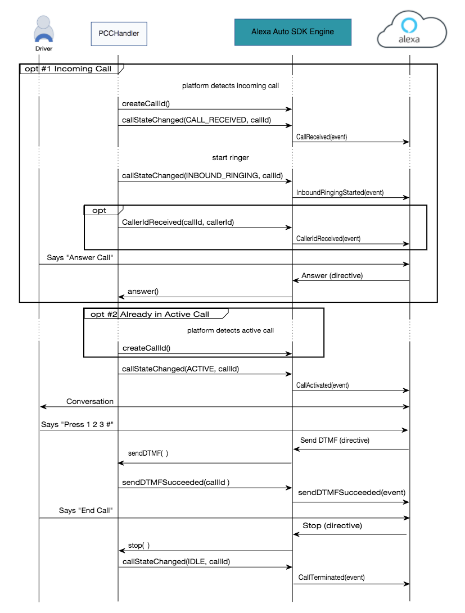
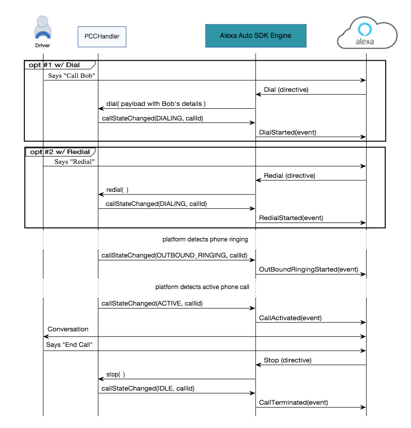

# Phone Call Controller API

## Overview

The Alexa Auto SDK Phone Call Controller API provides the features required by a platform implementation to use the phone call control capabilities of Alexa, independent of the connection mechanism to the calling device. Registering a Phone Call Controller allows the end user to use Alexa to interact with new or ongoing calls, and provide Alexa with the state of the calling device on the platform. The platform implementation is responsible for managing the lifecycle of the call session, including the end user experience.

## Sequence Diagrams

The following sequence diagrams provide and overview of how inbound and outbound phone call control is handled.

### Inbound Calling

This diagram provides an overview of inbound phone call control using voice.

### Outbound Calling

This diagram provides an overview of outbound phone call control using voice.

## Using Phone Call Controller

To implement a custom phone call controller handler, the `aace::phoneCallController::PhoneCallController` class should be extended:

    #include <AACE/PhoneCallController/PhoneCallController.h>

    class MyPhoneCallController : public aace::phoneCallController::PhoneCallController {

      // The user asked Alexa to make an outbound call.
      bool dial( const std::string& payload ) {
        // Initiate an outbound call.
        return true;
      }

      // The user asked Alexa to redial a call.
      bool redial( const std::string& payload ) {
        // Initiate an outbound call.
        // It is the platform's responsibility to maintain the last dialed number.
        return true;
      }

      // The user asked Alexa to answer the inbound call.
      void answer( const std::string& payload ) {
        // Answer the inbound call.
      }

      // The user asked Alexa to hang up a call, cancel a call setup, or decline an incoming call
      void stop( const std::string& payload ) {
        // Stop the call.
      }

      // The user asked Alexa to press the keypad.
      void sendDTMF( const std::string& payload ){
        // Send a DTMF signal.
      }

      // Return quickly, as handling in dial, redial, answer, stop, and sendDTMF should not block the caller.

      // Alexa acts on the most recently used callId.

        // Connection to a calling device is established or broken.
        ConnectionState state = ...  // CONNECTED, DISCONNECTED
        connectionStateChanged( state );
        ...

        // Setting up an outgoing call.
        const std::string& callId = ... // The identifier for the call.
        callStateChanged( CallState::DIALING, callId );
        ...

        // Outgoing call setup is complete, and outbound ringing has started.
        const std::string&callId = ... // The identifier for the call.
        callStateChanged( CallState::OUTBOUND_RINGING, callId );
        ...

        // The call is answered and in progress.
        const std::string& callId = ... // The identifier for the call.
        callStateChanged( CallState::ACTIVE, callId);
        ...

        // The active call ended, the outbound call setup was cancelled, or the inbound call was declined.
        const std::string& callId = ... // The identifier for the call.
        callStateChanged( CallState::IDLE, callId );
        ...

        // An inbound call alert was received.
        const std::string& callId = createCallId();
        callStateChanged( CallState::CALL_RECEIVED, callId );
        ...

        // The inbound call is ringing.
        const std::string& callId ... // The identifier for the call.
        callStateChanged( CallState::INBOUND_RINGING, callId );
        ...

        // Generate an identifier for a call initiated outside of the scope of Alexa.
        const std::string& callId = createCallId();
        ...

        // A feature of the calling device changed.
        std::unordered_map<CallingDeviceConfigurationProperty, bool> deviceConfigurationMap; // map to new configurations
        deviceConfigurationMap[CallingDeviceConfigurationProperty::DTMF_SUPPORTED] = true; // update the configuration
        deviceConfigurationUpdated( deviceConfigurationMap );
        ...

        // An error occurred during an active call or call setup.
        const std::string& callId = ... // The identifier for the call.
        CallError code  = ... // error type
        const std::string& message = ... // error description
        callFailed( callId, code, message );
        ...

        // The DTMF signal was delivered.
        const std::string& callId = ... // The identifier for the call.
        sendDTMFSucceeded( callId );
        ...

        // Sending the DTMF signal failed.
        const std::string& callId = ... // The identifier for the call.
        DTMFError code = ... // error type
        const std::string& message = ... // error description
        sendDTMFFailed( callId, code, message );
        ...
    };

    // Register a phone call controller handler with the Engine.
    std::shared_ptr<PhoneCallController> phoneCallController = std::make_shared<MyPhoneCallController>();
    engine->registerPlatformInterface( phoneCallController );

## Whitelisting

Please see the [Need Help?](../../NEED_HELP.md) page for how to whitelist your device for using Phone Call Control APIs.
