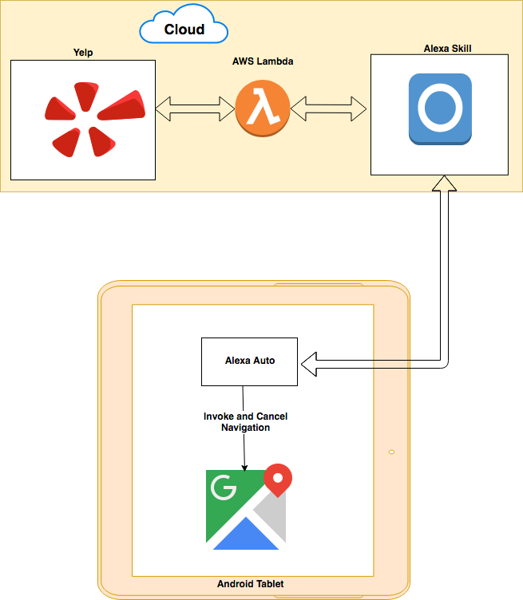

# alexa-auto

## quick guide to implement navigation invocation on the Alexa Auto Android Sample App using a custom skill


##### Prerequisites: Alexa Auto Android Sample App is already implemented and running per the official instructions:  https://github.com/alexa/aac-sdk


This demo requires the implementation of 2 pieces:

- Alexa Auto SDK must be modified to invoke Google Maps from the Tablet. Added logic also supports canceling navigation as well.
-  A Sample Skill that once triggered will invoke Yelp API and responds back with the closest and highest rating ice-cream shop in the proximity of the Android Tablet. A simple cost function is implemented to return a specific ice-cream shop.


### 1. Architecture



1. User invokes the custom skill from the Android Auto App, this example's skil is invoked by saying: "ice cream finder"
2. The skill uses the geolocation service on the invoking device and then send an API request to Yelp.
3. Yelp results are passed through a simple cost function that picks the 'best' result and send that result's GPS coordinates to the invoking Android Auto Sample App.
4. Android Auto Sample App will then invoke Google Maps with directions based on the longtitide and latitide that are sent by the skill.
5. Navigation will then start on the invoking device.
6. User can cancel navigation at anypoint by saying: "Cancel Navigation"


### 2. Alexa Auto SDK Changes

Changes must be implemented in the NavigationHandler.java class located in the following directory:

/aac-sdk/samples/android/app/src/main/java/com/amazon/sampleapp/impl/Navigation/


The MainActivity.java file will require one change as shown below:

```
mNavigation = new NavigationHandler( this, mLogger )
```


Althogu not needed for this demo but location information (Latitude, Longitude, Altitude) can be fetched by the below functions that are located in the LocationProviderHandler.java class that is located in the following directory:
aac-sdk/samples/android/app/src/main/java/com/amazon/sampleapp/impl/LocationProvider

- Double.toString(mCurrentLocation.getAltitude());
- Double.toString(mCurrentLocation.getLongitude());
- Double.toString(mCurrentLocation.getAltitude());


### 3. Custom Skill Implementation
NOTE: At the writing of this README, accesing geolocation through a custom skill requires whitelisting. The skill will not function properly without the approtiate whitelisting.

As a summay and for simplicity, as soon as the skill is invoked, it searches Yelp for the 'best' icecream shop in the device's proximity and then it sends a destination directive to the device invoking the request.

YELP Api key is needed for this skill to be able to invoke the Yelp API, this can be generated and must be defined in the AWS Console under the lampbda function. The Yelp API variable is: YELP_API_KEY, and the value can be found under Manage App page under the developer section of your Yelp account.
