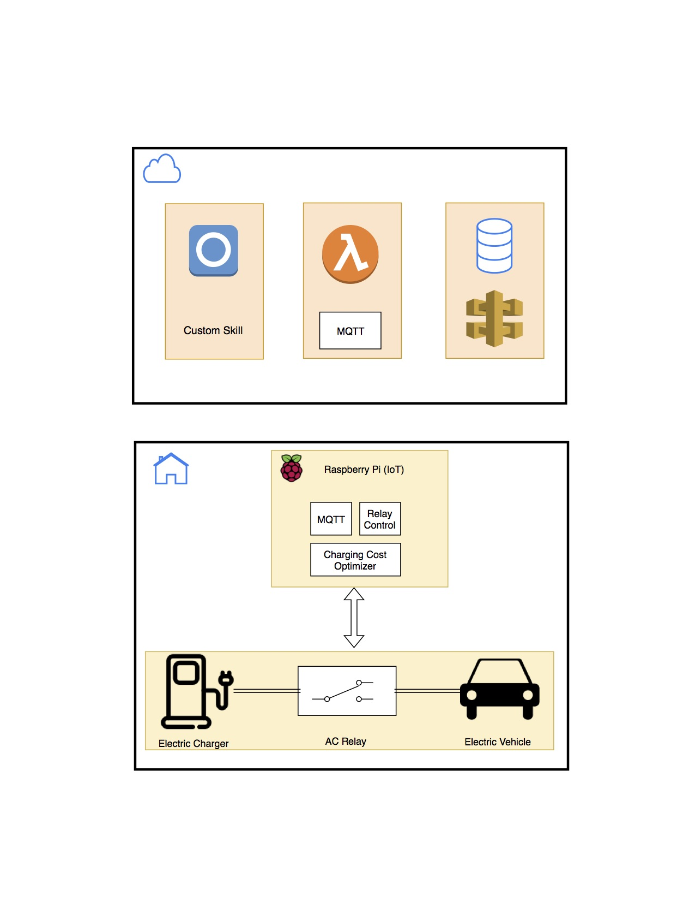

# alexa-ev-charging

Typically, electric vehicle (EV) owners plug in their vehicles as soon as they get home and they expect the vehicle to be fully charged in few hours given that their system supports high power charging (example: a 240 Volt system is installed). This in general is not ideal for both the drivers and the utility company for the following reasons:

1. Utility companies suffer from peak power usage in the afternoon, this is generally caused by a significant number of people heading home after work. People will then start their HVAC system, turn the lights on, and for the increasing percentage of EV owners plug in their car to charge. This massive peak might also cause damage to the local transformers due to these sudden loads. To mitigate this problem, utility companies introduced peak pricing. This means that the cost of electricity increases during some defined hours.

2. Given that peak hours are expensive, drivers are generally not aware of this and they end up paying for more money per kilo watt hour of energy.

Scheduled charging is an option that allows users to utilize their vehicle head unit or cell phone to schedule or allow charging to concur only during off-peak hours. This option is not very user friendly as the drivers need to spend some time setting up the schedule and it also requires knowing peak hours. Furthermore, it also requires adjustments when users have an emergency and they need to start charging immediately regardless of the cost.

This repo has the baseline for solving this problem using Alexa in the EV car by assuming the following scenraio:

As soon as the driver arrives home the user can say the following utterances (or any comparable variations)

1. “Alexa charge my car as soon as possible”
2. “Alexa charge my car with the cheapest option possible”

The user will then step out of the car and plugin their vehicle as they would normally do. These voice commands will then trigger the system to perform the required tasks as commanded by the user by either starting to charge immediately or delay charging by some time X as determined by the system.

When the user commands to start charging immediately, Alexa in the car through the local skill informs of this decision to the charge scheduling logic in the vehicle. This will allow charging to permit as soon as the user plugs in the charging adaptor and will stop when either charging is complete or when the charging cable is unplugged.

In the case when the user commands the cheapest charging option, the following sequence is initiated: Alexa Auto in the vehicle and again through the local skill will send this information to the cloud. The cloud (ex: lambda function) will through an already established database (DynamoDb in this scenario) or though API calls to the electric utility company will fetch the peak cost schedule and will send this information back to Alexa Auto. Alexa Auto will then send this information to the charging scheduler that will then respond accordingly. The architecture of the system is as follows:

#### Northern California Rates:

https://www.pge.com/tariffs/tm2/pdf/ELEC_SCHEDS_EV.pdf

## AWS Setup

1. Create an AWS IoT Policy
2. Create the Thing
3. Add permissions to the skill lambda function to permit access to AWS's IoT
4. Add permissions to the skill lambda fucntion to allow access to AWS's dynamoDB
For more info, check the official AWS documentation on this topic:
https://docs.aws.amazon.com/iot/latest/developerguide/iot-plant-watering.html 

## RPi Setup
3 files must be placed in the same directory as IoT_ChargerControl.py for the MQTT connection to work betwen the skill and the RPi. These certificate files can be downlowed from your AWS account during the AWS IoT setup process. 