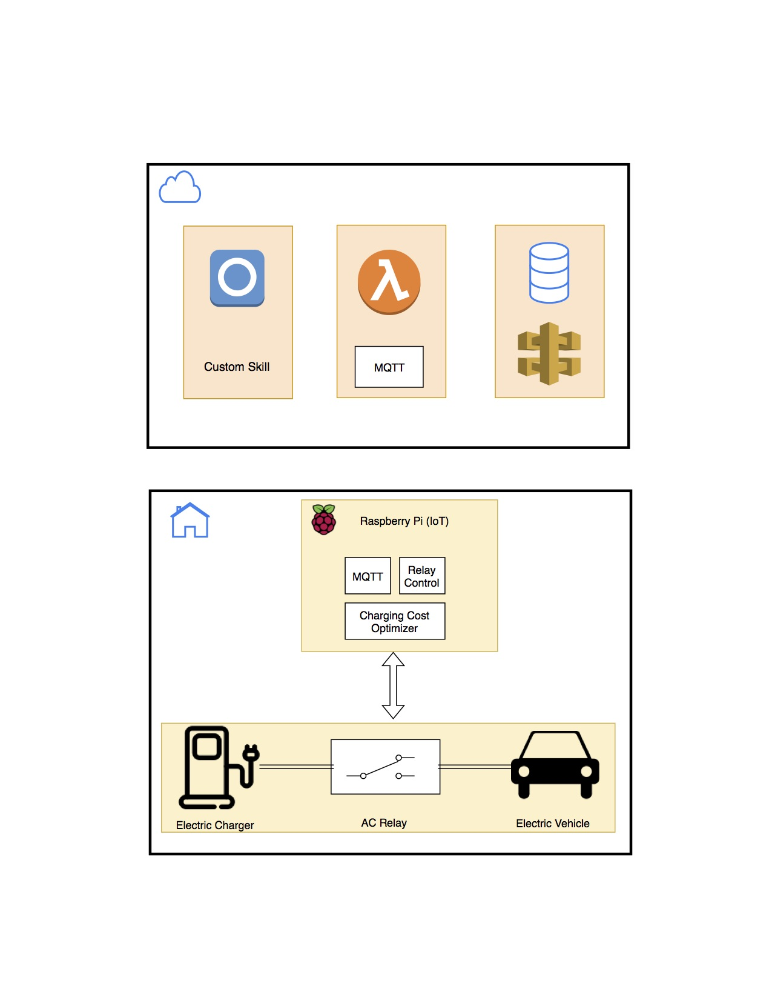

# alexa-ev-charging

## AWS Setup

1. Create an AWS IoT Policy
2. Create the Thing
3. Add permissions to the skill lambda function to permit access to AWS's IoT
4. Add permissions to the skill lambda fucntion to allow access to AWS's dynamoDB

