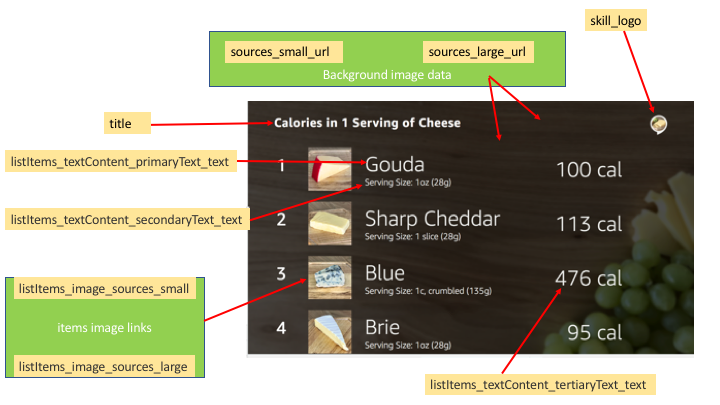

# quick apl list generator


## Steps to reproduce:

1. <launchRequest.json> must be present in the directory
2. Fill the info in the APL_Info_List.py (lines 5 to 42)
3. Run the script.
4. <launchRequest.json> will update accordingly and is ready to be used in the skill directive


## Legend

```python
# title, logo, and background image details
title = "List of charging stations"
sources_small_url = "https://d2o906d8ln7ui1.cloudfront.net/images/LT1_Background.png"
sources_large_url = "https://d2o906d8ln7ui1.cloudfront.net/images/LT1_Background.png"
skill_logo = "https://d2o906d8ln7ui1.cloudfront.net/images/cheeseskillicon.png"

#main name of the items
listItems_textContent_primaryText_text = ["Gouda",\
                                          "Sharp Cheddar",\
                                          "Blue",\
                                          "Brie"]

# secondary name of the items
listItems_textContent_secondaryText_text = [ "Serving Size: 1 on (28g)"\
                                            ,"Serving Size: 1 slice (28g)"\
                                            ,"Serving Size: 1 on (28g)"\
                                            ,"Serving Size: 1 on (28g)"]


# teritiary name of the items
listItems_textContent_tertiaryText_text = ["100 cal",\
                                           "113 cal",\
                                           "476 cal",\
                                           "95 cal"]

# items image links
listItems_image_sources_small = ["https://d2o906d8ln7ui1.cloudfront.net/images/sm_gouda.png", \
"https://d2o906d8ln7ui1.cloudfront.net/images/sm_gouda.png", \
"https://d2o906d8ln7ui1.cloudfront.net/images/sm_gouda.png", \
"https://d2o906d8ln7ui1.cloudfront.net/images/sm_gouda.png"]


listItems_image_sources_large = ["https://d2o906d8ln7ui1.cloudfront.net/images/sm_gouda.png", \
"https://d2o906d8ln7ui1.cloudfront.net/images/sm_gouda.png", \
"https://d2o906d8ln7ui1.cloudfront.net/images/sm_gouda.png", \
"https://d2o906d8ln7ui1.cloudfront.net/images/sm_gouda.png"]

```


